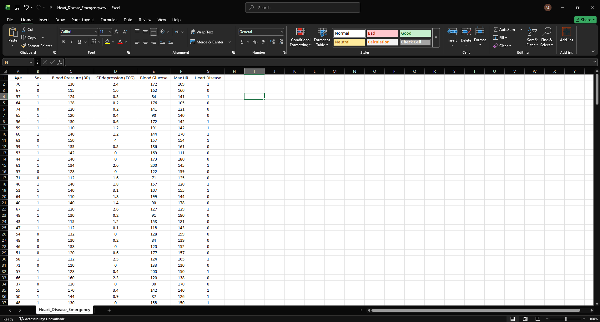

# Heart Disease Risk Prediction System

An emergency decision support system that predicts heart disease risk using machine learning.
The system estimates the probability of heart disease and provides rule-based medical explanations through an interactive graphical user interface (GUI).

> ⚠️ This project is for educational purposes only and must not be used for real medical diagnosis.

---

## Project Features

- Logistic Regression model for heart disease classification
- Probability-based risk prediction
- Risk level categorization (Low / Medium / High)
- Rule-based medical explanations
- Interactive GUI built with Tkinter
- Data preprocessing using Scikit-learn Pipeline

---

## Machine Learning Model
- **Algorithm:** Logistic Regression
- **Preprocessing:** StandardScaler
- **Pipeline:** Scaler + Classifier
- **Output:**
  - Probability of heart disease
  - Binary classification (0 = No Disease, 1 = Disease)

---

## Input Features
The model uses the following patient parameters:
- Age
- Sex (Male = 1, Female = 0)
- Blood Pressure (BP)
- Maximum Heart Rate
- ST Depression (ECG)
- Blood Glucose Level

---

## Risk Interpretation
Based on the predicted probability:
- **Low Risk:** < 30%
- **Medium Risk:** 30% – 60%
- **High Risk:** > 60%

---

## Explainability

The system provides human-readable explanations based on medical rules, such as:
- High blood pressure
- Elevated blood glucose
- Abnormal heart rate
- Abnormal ST depression (ECG)

This improves transparency and trust in the model predictions.

---

## Graphical User Interface
- Built using **Tkinter**
- Simple and intuitive input form
- Instant prediction with probability and explanation

---

## Technologies Used
- Python
- Pandas
- NumPy
- Scikit-learn
- Tkinter

---

## How to Run the Project

### 1️⃣ Install dependencies
```bash
pip install -r requirements.txt
```
### 2️⃣ Run the application
```bash
python project/main.py
```

## 📁 Project Structure
```
heart-disease-risk-prediction/
│
├── assets/
│ ├── gui.png # GUI screenshot
│ └── data_base.png # Dataset preview image
│
├── project/
│ ├── Heart_Disease_Emergency.csv # Our data_base
│ └── main.py # Application entry point
│
├── LICENSE
├── README.md
└── requirements.txt

```
